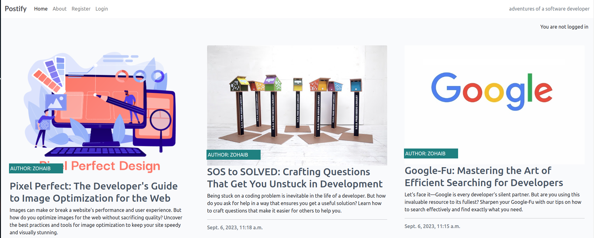

# Postify

Postify is a Django-based web application that allows users to read and interact with blog posts. It provides functionalities for both administrators and regular users.



## Features

- **Blog Posts**: Admins can add, edit, and delete blog posts.
- **User Comments**: Registered users can comment on blog posts.
- **Comment Approval**: User comments are initially in a pending state and require admin approval.
- **CRUD Operations**: Users can perform CRUD operations on their own comments.
- **Authentication**: Allauth is used for authentication, signup, and signin functionalities.

## Technologies Used

- **Django**: Python-based web framework for backend development.
- **HTML/CSS**: Frontend styling and structure.
- **JavaScript**: Frontend interactivity and enhancements.

## Installation

To run Postify locally, follow these steps:

1. Clone the repository: `git clone https://github.com/zohaibshahzadkhan/Postify`
2. Navigate to the project directory: `cd postify`
3. Install dependencies: `pip install -r requirements.txt`
4. Apply migrations: `python manage.py migrate`
5. Create a superuser: `python manage.py createsuperuser`
6. Run the development server: `python manage.py runserver`
7. Access the application at: `http://localhost:8000`

## Environment Variables

To run the application, you need to set up the following environment variables:

- **DATABASE_URL**: The URL of your PostgreSQL database from ElephantSQL.
- **CLOUDINARY_URL**: The URL for Cloudinary setup, required for image loading.
- **SECRET_KEY**: Secret key for Django application.

You can create a `.env` file in the project root directory and define these variables there.

Example `.env` file:

```
import os

os.environ.setdefault("DATABASE_URL","your_postgres_url")

os.environ.setdefault("SECRET_KEY","your_secret_key")

os.environ.setdefault("CLOUDINARY_URL", "your_cloudinary_url")
```
## Usage

- **Admin Access**: Access the admin dashboard at `/admin` and log in with the superuser credentials to manage blog posts and comments.
- **User Access**: Users can browse blog posts, register, login, and comment on posts. Their comments will be pending approval until authorized by an admin.

## Contributing

Contributions are welcome! If you have any suggestions, bug reports, or feature requests, please open an issue or submit a pull request.

## Credits

This project was developed as part of my learning journey with [Code Institute](https://codeinstitute.net/). I would like to express my gratitude to their instructors and curriculum for providing comprehensive Django tutorials and resources.

Special thanks to:

- **[Code Institute](https://codeinstitute.net/) Team**: For their dedication to providing quality education and support.


